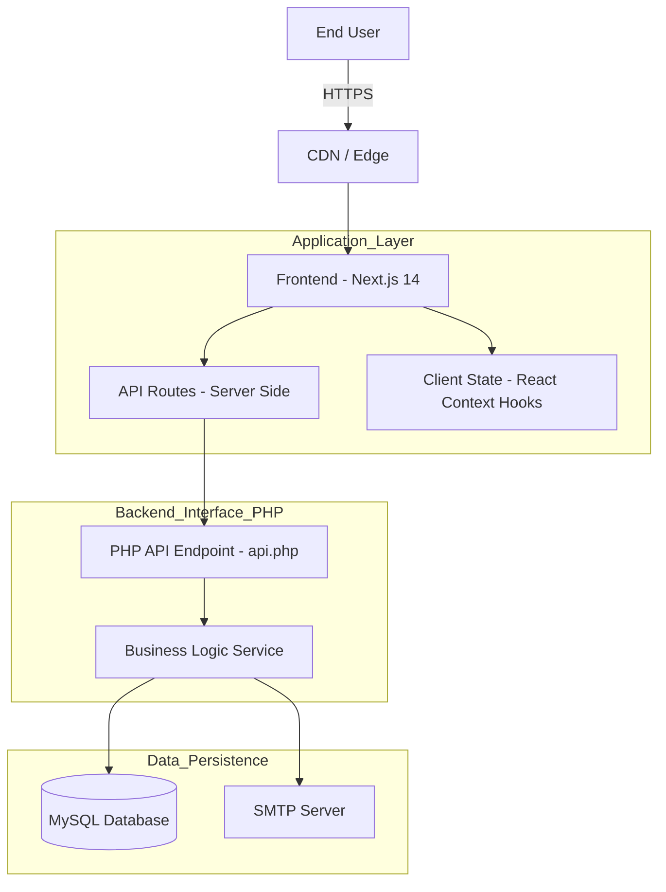

<div align="center">

  <h1>📊 Performance Eval - HR Assessment System</h1>
  <h3>ระบบประเมินผลการปฏิบัติงานเจ้าหน้าที่ - สหกรณ์ออมทรัพย์ มหาวิทยาลัยเกษตรศาสตร์ จำกัด</h3>

  <p>
    <a href="https://nextjs.org">
      
    </a>
    <a href="https://www.php.net">
      
    </a>
    <a href="https://tailwindcss.com">
      
    </a>
    <a href="https://www.mysql.com">
      
    </a>
  </p>
  
  <p>
    <b>ระบบบริหารจัดการและประเมินผลการปฏิบัติงาน (Performance Evaluation System)</b><br>
    พัฒนาขึ้นเพื่อเพิ่มประสิทธิภาพ ความโปร่งใส และความรวดเร็วในการประเมินผลบุคลากรภายในองค์กร
  </p>

</div>

---

## 📖 เกี่ยวกับโครงการ (About The Project)

**Performance Evaluation System** เป็นระบบเว็บแอปพลิเคชันสำหรับฝ่ายทรัพยากรบุคคล (HR) ใช้บริหารจัดการกระบวนการประเมินผลการปฏิบัติงานของพนักงานอย่างเป็นระบบ โปร่งใส และตรวจสอบได้

ระบบถูกออกแบบมาเพื่อแทนที่การประเมินผลแบบกระดาษเดิม โดยเปลี่ยนมาใช้รูปแบบดิจิทัลเต็มรูปแบบ รองรับโครงสร้างองค์กรที่มีลำดับชั้นซับซ้อน (Hierarchical Organization) ตั้งแต่ระดับเจ้าหน้าที่ หัวหน้างาน ผู้ช่วยผู้จัดการ ผู้จัดการ และคณะกรรมการ

### ✨ ฟีเจอร์หลัก (Key Features)

*   **📱 Responsive & Modern UI:** ออกแบบด้วยแนวคิด Mobile-First และ Modern Dashboard ใช้งานง่ายบนทุกอุปกรณ์
*   **🔐 Role-Based Access Control (RBAC):** ระบบจัดการสิทธิ์ผู้ใช้งานตามตำแหน่ง (Staff, Head, Asst, Manager, Committee, Admin)
*   **📝 Dynamic Evaluation Form:** แบบประเมินที่ปรับเปลี่ยนหัวข้อและน้ำหนักคะแนนตามตำแหน่งงานอัตโนมัติ (Performance & Competency)
*   **📊 Real-time Analytics:** คำนวณคะแนน เกรด และสรุปผลแบบ Real-time พร้อมกราฟวิเคราะห์
*   **🛡️ Secure Data Handling:** ไม่เก็บข้อมูล Sensitive ลงใน Git และมีการจัดการ Session ที่ปลอดภัย
*   **📧 Automated Notification:** ส่งอีเมลแจ้งเตือนและสรุปผลการประเมินผ่าน SMTP Server
*   **⚙️ Powerful Admin Console:** เครื่องมือสำหรับผู้ดูแลระบบครบวงจร (จัดการผู้ใช้, ปรับฐานคะแนน, ตั้งค่าระบบ)

---

## 🏗️ สถาปัตยกรรมระบบ (System Architecture)



---

## 🚀 การติดตั้งและใช้งาน (Getting Started)

### สิ่งที่ต้องเตรียม (Prerequisites)
*   **Node.js** (v18.x ขึ้นไป)
*   **PHP Web Server** (Apache/Nginx หรือ XAMPP/MAMP)
*   **MySQL Database**

### ขั้นตอนการติดตั้ง (Installation)

1.  **Clone Repository**
    ```bash
    git clone https://github.com/kuscc-it/performance-eval.git
    cd performance-eval
    ```

2.  **Install Frontend Dependencies**
    ```bash
    npm install
    ```

3.  **Setup Database**
    *   สร้าง Database ใหม่ชื่อ `hr_evaluation_pro`
    *   Import โครงสร้างตารางจากไฟล์ `schema.sql` (ติดต่อผู้ดูแลระบบเพื่อขอไฟล์โครงสร้าง)

4.  **Configure Backend**
    *   นำไฟล์ `api.php` และ `SmtpMailer.php` ไปวางใน Folder ของ Web Server (เช่น `htdocs` หรือผ่าน Proxy)
    *   แก้ไขการเชื่อมต่อ Database ใน `api.php` หรือแยกไฟล์ Config ต่างหาก
    *   *Note:* ไฟล์เหล่านี้ถูก exclude จาก Git เพื่อความปลอดภัย

5.  **Run Application**
    ```bash
    npm run dev
    ```
    เข้าใช้งานได้ที่ `http://localhost:3000`

---

## 📂 โครงสร้างโปรเจค (Project Structure)

```
performance-eval/
├── app/                    # Next.js App Router (Pages & Layouts)
│   └── api/                # API Routes (OTP Request, Proxy)
├── components/             # React Components (Modular)
│   ├── admin/              # Admin Dashboard Components
│   ├── assessment/         # Evaluation Forms & Tables
│   ├── auth/               # Authentication Screens
│   ├── layout/             # Main Layouts & Providers
│   └── ui/                 # Reusable UI Components
├── hooks/                  # Custom React Hooks
├── lib/                    # Core Utilities (Constants, Types, Utils)
├── public/                 # Static Assets
├── api.php                 # PHP Backend Entry Point (Ignored)
└── SmtpMailer.php          # SMTP Email Service (Ignored)
```

---

## 🛠️ การบำรุงรักษาและต่อยอด (Maintenance)

*   Logic การคำนวณคะแนนอยู่ที่: `lib/helpers.ts` (Frontend) และความสอดคล้องใน `api.php` (Backend)
*   โครงสร้างรองรับการเพิ่ม: 360-Degree Evaluation, Performance Cycle หลายรอบ และ Dashboard เชิงวิเคราะห์ (BI)

---

## 🤝 การมีส่วนร่วม (Contributing)

เรารับฟังข้อเสนอแนะและ Issue จากทีมพัฒนาเสมอ เพื่อปรับปรุงระบบให้ดียิ่งขึ้น

---

## 📝 License

**Private / Internal Use Only**
ห้ามเผยแพร่หรือใช้งานเชิงพาณิชย์โดยไม่ได้รับอนุญาต

---

<div align="center">
  <p>Developed with ❤️ by <b>Kiatnarong Thanomsap</b></p>
  <p>IT Department - Kasetsart University Savings and Credit Cooperative Limited</p>
</div>
